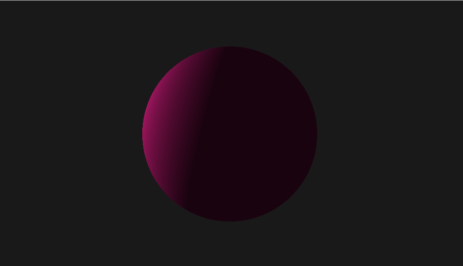
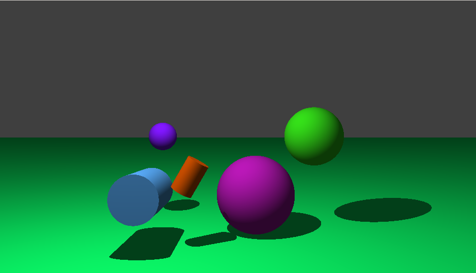
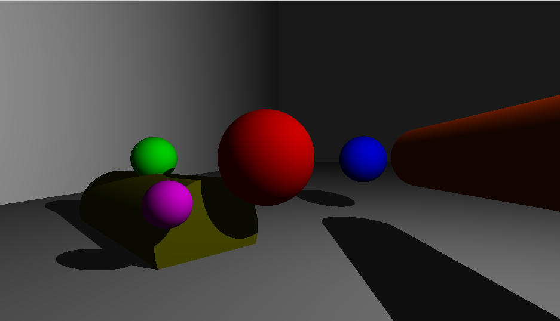
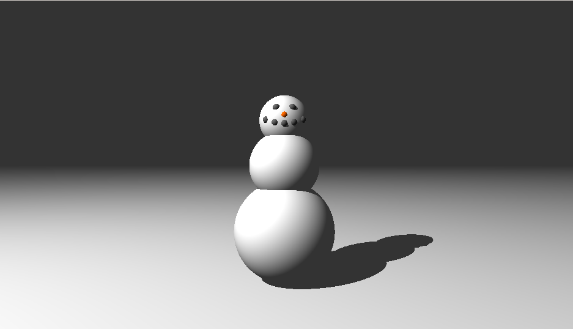

# miniRT
`miniRT` is a ray tracer written in C that generates 3D images based on a scene description file. Built as a team project, it showcases essential ray tracing concepts such as lighting, shadows, and geometric transformations.  

---

## **Features**

---

## **Features**

- **Supported Geometric Objects**:
  - Plane
  - Sphere
  - Cylinder
- **Light Management**:
  - Adjustable spot brightness
  - Hard shadows
  - Ambient lighting
  - Diffuse lighting
- **Interactive Controls**:
  - Rotate using:
    - **Arrow keys**: Rotate around the X and Y axes.
    - `+` / `-` keys: Rotate around the Z axis.
  - Zoom in/out using the mouse wheel or `+`/`-` keys.
  - Exit with `ESC` or by clicking the window's close button.
- **Scene Customization**:
  - Define planes, spheres, and cylinders using `.rt` scene files.
  - Example scene files included in the `scenes` folder.

---

Let me know if you’d like further adjustments!

---

## **Installation**

### 1. Clone the Repository
```bash
$ git clone https://github.com/your-username/miniRT.git
$ cd miniRT
```

### 2. MinilibX Library
Ensure the `minilibx-linux` folder is in the root of the repository.

### 3. Build the Project
Use the provided Makefile to compile both `miniRT` and `MinilibX`:
```bash
$ make
```

---

## **Usage**

Run the program with a scene description file (with a `.rt` extension):
```bash
$ ./miniRT scenes/example.rt
```

---

## **.rt Scene File Description**

Each `.rt` file describes the scene and objects to be rendered. The file follows these rules:
- **First information**: A type identifier (one or two characters).
- **Subsequent information**: Specific attributes for the object, listed in a **strict order**.
- Elements can be separated by one or more line breaks.
- Data within an element can be separated by one or more spaces.
- Elements defined by **capital letters** (e.g., `A`, `C`, `L`) must appear **only once** in the file.

### **Supported Elements and Format**
#### **Ambient Lighting**
```text
A 0.2 255,255,255
```
- Identifier: `A`
- Ambient lighting ratio `[0.0,1.0]`: `0.2`
- RGB color `[0-255]`: `255,255,255`

#### **Camera**
```text
C -50.0,0,20 0,0,1 70
```
- Identifier: `C`
- Viewpoint coordinates: `-50.0,0,20`
- Normalized orientation vector `[x,y,z in [-1,1]]`: `0,0,1`
- Field of view (FOV) `[0,180]`: `70`

#### **Light**
```text
L -40.0,50.0,0.0 0.6 10,0,255
```
- Identifier: `L`
- Light source coordinates: `-40.0,50.0,0.0`
- Brightness ratio `[0.0,1.0]`: `0.6`
- RGB color `[0-255]`: `10,0,255`

#### **Sphere**
```text
sp 0.0,0.0,20.6 12.6 10,0,255
```
- Identifier: `sp`
- Center coordinates: `0.0,0.0,20.6`
- Diameter: `12.6`
- RGB color `[0-255]`: `10,0,255`

#### **Plane**
```text
pl 0.0,0.0,-10.0 0.0,1.0,0.0 0,0,225
```
- Identifier: `pl`
- Point coordinates on the plane: `0.0,0.0,-10.0`
- Normalized vector `[x,y,z in [-1,1]]`: `0.0,1.0,0.0`
- RGB color `[0-255]`: `0,0,225`

#### **Cylinder**
```text
cy 50.0,0.0,20.6 0.0,0.0,1.0 14.2 21.42 10,0,255
```
- Identifier: `cy`
- Center coordinates: `50.0,0.0,20.6`
- Normalized axis vector `[x,y,z in [-1,1]]`: `0.0,0.0,1.0`
- Diameter: `14.2`
- Height: `21.42`
- RGB color `[0-255]`: `10,0,255`

Example `.rt` files can be found in the `scenes` folder.

---

## **Controls**

- **Rotate**: Arrow keys  
- **Zoom In/Out**: Keys `+`/`-` (American keyboard)  
- **Exit**: Press `ESC` or click the window’s close button  

---

## **Examples**

Generated images from `miniRT`:  









---

## **Team**

This project was developed by:
- **zhedlund** ([GitHub](https://github.com/zhedlund))  
- **dzhoka** ([GitHub](https://github.com/dzhoka))

---

## **Made For**

- Linux operating systems.

---

## **Acknowledgments**

`miniRT` was developed as part of a hands-on exploration of computer graphics at 42 Berlin.

---

## **License**

This project is licensed under the [MIT License](LICENSE).
